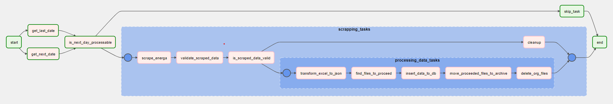
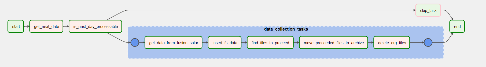
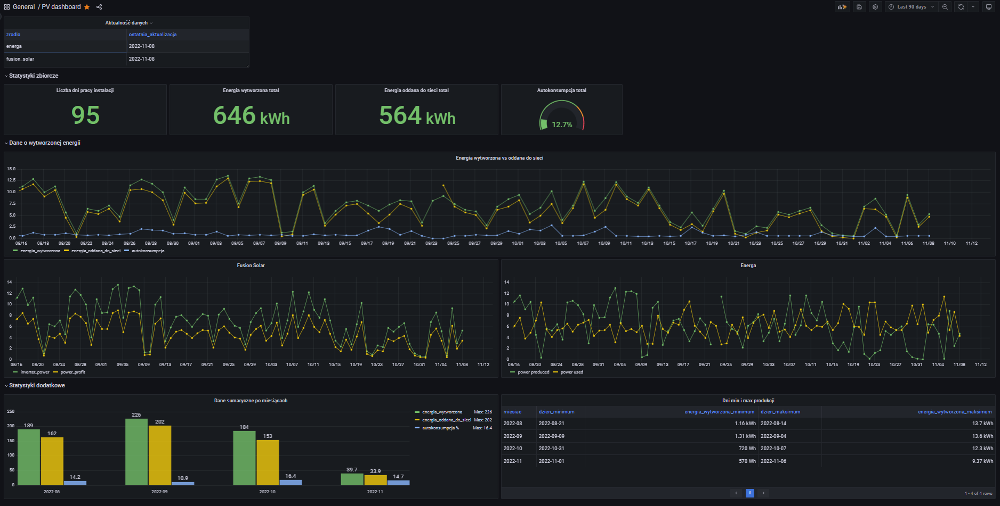

# Goal
Main goal of this project is to consolidate data from Fusion Solar inverter and mojlicznik.energa-operator.pl and insert them into PostgreSQL to create dashboard in Grafana and enable further analysis. 

# Technology
* Python 
* Docker
* Apache Airflow
* PostgreSQL
* Grafana

# Data Pipelines
There are 3 data pipelines:
* **pv_energa_pipeline** for gatering data from mojlicznik.energa-operator.pl by scrapping using Selenium

* **pv_fs_pipeline for** gathering data from FusionSolar API

* **pv_db_dump_pipeline** which only purpose is creating cyclic dump of database

# Grafana Dashboard


# Configuration
## Usernames etc.
Usernames, passwords, urls etc. are configured in config.json file in `airflow/dags/modules/`. Variable names are self-explaining.

## Python packages
To import DAG to airflow, selenium python package must be installed in the pv_airflow_scheduler container. Any other packeges are included in Airlfow by default.
Follow these steps:
1. After starting the app, find pv_airflow_scheduler container id:
```bash
docker ps
```
2. Start bash in the pv_airflow_scheduler container:
```bash
docker exec -it <container id> bash
```
3. Install selenium
```bash
sudo pip install selenium
```

# Starting the app
```bash
docker compose up
```